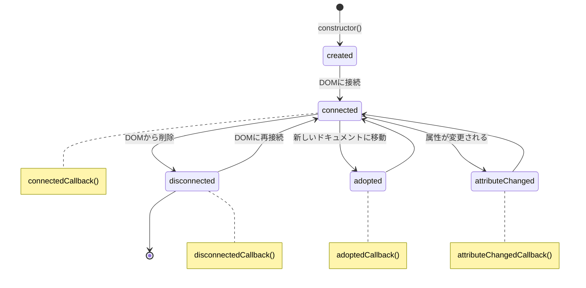

# Custom Element のライフサイクル

`Custom Elements` は DOM に追加・削除されたり、属性が変更されたときに特定の処理を行うことができます。  
これを可能にするのが **ライフサイクルメソッド** です。  
ライフサイクルメソッドは、Web Components が動的に生成、更新、破棄されるタイミングで自動的に呼び出されます。

## 🔹 主なライフサイクルメソッド
| メソッド | 説明 |
|---|---|
| `connectedCallback()`       | 要素が DOM ツリーに追加されたときに呼ばれる |
| `disconnectedCallback()`    | 要素が DOM ツリーから削除されたときに呼ばれる |
| `adoptedCallback()`         | 要素が他のドキュメントに移動されたときに呼ばれる |
| `attributeChangedCallback()` | 要素の監視対象の属性が変更されたときに呼ばれる |

## 📌 connectedCallback()
このメソッドは、カスタム要素が DOM ツリーに追加された際に呼ばれます。  

### 主な用途
- 要素の初期化
- イベントリスナーの登録
- API 呼び出しの開始

```ts
class ConnectedComponent extends HTMLElement {
  connectedCallback() {
    console.log("要素が DOM に追加されました");
    this.innerHTML = `<p>初期化完了</p>`;
  }
}

customElements.define('connected-component', ConnectedComponent);
```

```html
<connected-component></connected-component>
```

### 実用例: 初期データの読み込み

```ts
class DataLoader extends HTMLElement {
  private _data: any[] = [];
  
  connectedCallback() {
    // DOM追加時にデータ取得を開始
    this.innerHTML = `<div class="loader">データを読み込み中...</div>`;
    this.fetchData();
  }
  
  async fetchData() {
    try {
      const response = await fetch('https://api.example.com/data');
      this._data = await response.json();
      this.render();
    } catch (error) {
      this.innerHTML = `<div class="error">データの読み込みに失敗しました</div>`;
    }
  }
  
  render() {
    if (this._data.length === 0) {
      this.innerHTML = `<div class="empty">データがありません</div>`;
      return;
    }
    
    this.innerHTML = `
      <ul class="data-list">
        ${this._data.map(item => `<li>${item.name}</li>`).join('')}
      </ul>
    `;
  }
}

customElements.define('data-loader', DataLoader);
```


## 📌 disconnectedCallback()
このメソッドは、要素が DOM ツリーから削除された際に呼ばれます。  

### 主な用途
- イベントリスナーの解除
- タイマーやインターバルのクリア
- リソースの解放

```ts
class DisconnectedComponent extends HTMLElement {
  private timer: number;

  connectedCallback() {
    this.timer = setInterval(() => {
      console.log("動作中...");
    }, 1000);
  }

  disconnectedCallback() {
    console.log("要素が DOM から削除されました");
    clearInterval(this.timer);
  }
}

customElements.define('disconnected-component', DisconnectedComponent);
```

```html
<disconnected-component></disconnected-component>
```

### 実用例: リソース解放とメモリリーク防止

```ts
class VideoPlayer extends HTMLElement {
  private videoElement: HTMLVideoElement | null = null;
  private resizeObserver: ResizeObserver | null = null;
  
  connectedCallback() {
    // ビデオ要素の作成と設定
    this.videoElement = document.createElement('video');
    this.videoElement.src = this.getAttribute('src') || '';
    this.videoElement.controls = true;
    this.appendChild(this.videoElement);
    
    // イベントリスナーの追加
    this.videoElement.addEventListener('play', this.handlePlay);
    
    // ResizeObserverの設定
    this.resizeObserver = new ResizeObserver(this.handleResize);
    this.resizeObserver.observe(this);
  }
  
  disconnectedCallback() {
    // イベントリスナーの解除
    if (this.videoElement) {
      this.videoElement.removeEventListener('play', this.handlePlay);
      this.videoElement.pause();
      this.videoElement.src = ''; // メモリ解放
    }
    
    // ResizeObserverの解除
    if (this.resizeObserver) {
      this.resizeObserver.disconnect();
      this.resizeObserver = null;
    }
  }
  
  private handlePlay = () => {
    console.log('動画の再生を開始しました');
  }
  
  private handleResize = (entries: ResizeObserverEntry[]) => {
    console.log('サイズが変更されました:', entries[0].contentRect);
  }
}

customElements.define('video-player', VideoPlayer);
```


## 📌 adoptedCallback()
このメソッドは、要素が別の `Document` に移動された際に呼ばれます。  
通常の開発では多く使用されませんが、`iframe` の中に移動された場合や、`document.adoptNode()` によって移動されたときに発火します。

```ts
class AdoptedComponent extends HTMLElement {
  adoptedCallback() {
    console.log("他のドキュメントに移動されました");
  }
}

customElements.define('adopted-component', AdoptedComponent);
```

### 実用例: クロスフレームの状態維持

```ts
class CrossFrameComponent extends HTMLElement {
  private state = {
    counter: 0,
    lastUpdated: new Date()
  };
  
  connectedCallback() {
    this.render();
  }
  
  adoptedCallback() {
    // 新しいドキュメントに移動したときに状態を更新
    this.state.lastUpdated = new Date();
    this.state.counter++;
    this.render();
    
    // 移動イベントを発火
    this.dispatchEvent(new CustomEvent('adopted', {
      detail: { state: this.state },
      bubbles: true,
      composed: true
    }));
  }
  
  render() {
    this.innerHTML = `
      <div class="cross-frame">
        <p>カウンター: ${this.state.counter}</p>
        <p>最終更新: ${this.state.lastUpdated.toLocaleString()}</p>
        <p>現在のドキュメント: ${document.title || 'メインドキュメント'}</p>
      </div>
    `;
  }
}

customElements.define('cross-frame', CrossFrameComponent);
```


## 📌 attributeChangedCallback()
このメソッドは、要素の属性が変更されたときに発火します。  
監視する属性は **observedAttributes** のゲッターで定義する必要があります。

```ts
class AttributeComponent extends HTMLElement {
  static get observedAttributes() {
    return ['color', 'size'];
  }

  attributeChangedCallback(name: string, oldValue: string, newValue: string) {
    console.log(`属性 ${name} が ${oldValue} から ${newValue} に変更されました`);
    this.style.color = name === 'color' ? newValue : this.style.color;
    this.style.fontSize = name === 'size' ? `${newValue}px` : this.style.fontSize;
  }
}

customElements.define('attribute-component', AttributeComponent);
```

```html
<attribute-component color="red" size="20"></attribute-component>
```

## 🔹 ライフサイクル図

カスタム要素のライフサイクルには、実装の順序によって異なるケースも存在します。以下は、一般的なライフサイクルのフローを示しています。



### カスタム要素の状態遷移の説明
|状態|説明|
|---|---|
|**Created**|要素が`constructor`を通じて作成された状態<br>この時点ではDOMに接続されていない|
|**Connected**|要素がDOMツリーに追加された状態<br>**このタイミングで `connectedCallback()` が呼ばれる**|
|**AttributeChanged**|`observedAttributes`で監視している属性が変更された状態<br>**このタイミングで `attributeChangedCallback()` が呼ばれる**|
|**Disconnected**|要素がDOMツリーから削除された状態<br>**このタイミングで `disconnectedCallback()` が呼ばれる**|
|**Adopted**|要素が別のDocumentに移動された状態<br>**このタイミングで `adoptedCallback()` が呼ばれる**|

## 🔹 TypeScriptでの実装方法
より詳細なTypeScript実装については → [TypeScriptライフサイクル実装ガイド](../typescript/lifecycle-and-events.html)

## 🔹 まとめ
- Custom Elements はライフサイクルメソッドを持ち、DOM の変更に応じて処理を行える。
- `connectedCallback` と `disconnectedCallback` は主にイベントリスナーの登録・解除やリソース管理に使われる。
- `attributeChangedCallback` は監視する属性を明示的に設定し、属性の変更に応じて要素の挙動やスタイルを動的に更新できる。
- `adoptedCallback` は異なるドキュメント間での要素の移動時に状態を維持するのに使用できる。
- ライフサイクルを適切に活用することで、より効率的で管理しやすく、リソースリークがないコンポーネント設計が可能。