# Shadow DOM

**Shadow DOM** は、Web Components の主要な構成要素の一つで、要素内部の DOM 構造を外部のスタイルやスクリプトから隔離する技術です。これにより、真の意味でのカプセル化が実現できます。

### 例
```js
const div = document.querySelector('div');
const shadowRoot = div.attachShadow({
  mode: 'open',
});
const p = document.createElement('p');
p.textContent = 'Shadow DOM World!';
shadowRoot.appendChild(p);
```


## 🔹 Shadow DOM の主な特徴

- スタイルと構造のカプセル化:
   - 外部の CSS が影響しない。
   - 内部の DOM 構造が外部スクリプトから直接操作されない。
- 独立した DOM ツリー:
   - 通常の DOM の一部として存在するが、shadowRoot によって分離される。
- スコープ付きの CSS:
   - シャドウ DOM 内のスタイルは外部に影響を与えず、外部のスタイルの影響も受けない。

## 🔹 なぜ Shadow DOM が重要か？

最近のフロントエンドフレームワーク（React、Vue、Angular など）では、各コンポーネントが独立したスタイルスコープを持ち、外部の影響を受けずに動作する設計が一般的です。  
**Shadow DOM** はこれを **ネイティブ Web 標準として提供** することで、以下のメリットを実現しています。

1. **フレームワークに依存しないカプセル化**
   - JavaScript フレームワークを使用しなくても、Web 標準だけでスタイルと DOM の隔離が可能です。
   - 軽量で依存が少なく、サーバーサイドレンダリング（SSR）とも相性が良い。

2. **他のフレームワークと衝突しない**
   - アプリケーションが複数のライブラリやフレームワークで構成されていても、影響を受けることなく動作します。
   - 例として、Vue コンポーネント内で Shadow DOM を持つカスタム要素をそのまま使用できます。

3. **真のカプセル化**
   - スタイルのリークや CSS の衝突が完全になくなります。
   - 例えば、親要素の `display: none` や `overflow: hidden` の影響を受けず、独立して動作可能です。

## 🔹 Shadow DOM　における構成
### 構成
| 用語 | 説明 |
|---|---|
| `Shadow Host` |  Shadow DOMを取り付ける通常のDOM要素（例：カスタム要素） |
| `Shadow Root` | Shadow DOM のルートノード<br>`element.attachShadow()`によって作成される特殊なルートノード。<br>これが`Shadow Boundary`を確立し、内部のコンテンツとスタイルをカプセル化します。 |
| `Shadow Tree` |  Shadow Root内に構築されるDOM要素のツリー |
| `Shadow Boundary` | Shadow DOM内のコンテンツとLight DOM（外部DOM）を分離する概念的な境界<br>これにより<ul><li>外部からのクエリセレクタによる内部要素の選択防止</li><li>CSS定義のスコープ分離</li><li>イベントの再ターゲティング（retargeting）</li></ul>|

### 構成図

```mermaid
graph TB
    A[Shadow Host] --> |"attachShadow()"| B[Shadow Root]
    
    G[Light DOM] -.-> |"スロットを通じて投影"| D

    H[Shadow DOM] -.- shadowBoundary
    style H fill:#333,stroke:#333,stroke-dasharray: 5 5

    subgraph shadowBoundary["Shadow Boundary"]
        B --> C[Shadow Tree]
        C --> D[スロット]
        C --> E[スタイル]
        C --> F[内部DOM要素]
    end    
```


Shadow DOM は `Shadow Boundary` によって Light DOM と明確に区切られています。  
この境界により、内部の要素は外部から影響を受けず、独立したスタイルや構造を保持します。

## 🔹 Shadow DOM の作成

```html
<!DOCTYPE html>
<html lang="ja">
<body>
  <div id="host"></div>

  <script>
    // シャドウ DOM を作成
    const hostElement = document.getElementById("host");
    const shadowRoot = hostElement.attachShadow({ mode: "open" });

    // シャドウ DOM 内に要素を追加
    shadowRoot.innerHTML = `
      <style>
        p {
          color: red;
          font-weight: bold;
        }
      </style>
      <p>シャドウ DOM 内の要素</p>
    `;
  </script>
</body>
</html>
```


## 🔹 Shadow DOM が継承できる属性

`Shadow Tree`と `<slot>` 要素は、シャドウホストから `dir` および `lang` 属性を継承しています。

Shadow DOM 内部の要素は、シャドウホスト（Shadow Host）から特定の属性を自動的に継承します。  
これは、

### 🎯 継承される属性一覧
| 属性名   | 説明                             | 使用例                     |
|-----------|--------------------------------|--------------------------|
| `dir`     | テキストの方向（`ltr` 左から右、`rtl` 右から左） | `<div dir="rtl">`        |
| `lang`    | 言語設定（例：`en`, `ja`）       | `<div lang="ja">`        |
| `slot`    | `<slot>` 要素へのスロット指定   | `<span slot="header">`   |

## 🔹 Shadow DOM の種類

`attachShadow()` の `mode` オプションには `"open"` と `"closed"` の2種類があります。  
`attachShadow({ mode })` を使って作成し、`mode` に `"open"` や `"closed"` を指定します。

| モード        | 特徴                                | アクセス方法                    | 主な利用シーン                          |
|--------------|-----------------------------------|--------------------------------|------------------------------------|
| **open**    | 外部から参照・操作が可能            | `element.shadowRoot` でアクセス | **開発者が外部からのアクセスを必要とする場合**。例えば、開発者ツールでのデバッグ、外部スクリプトからの DOM 操作、テスト用スクリプトなど。 |
| **closed**  | 外部から参照・操作が不可能          | JavaScript からもアクセス不可   | **完全なカプセル化が求められる場合**。他のスクリプトや開発者ツールから内部構造を隠したい場合に使用。セキュアなフォームやプライバシー重視のウィジェットなど。 |

### 🎯 違いの具体例
```js
const el = document.createElement("div");

// open モード（外部からアクセス可能）
const shadowOpen = el.attachShadow({ mode: "open" });
shadowOpen.innerHTML = `<p>Open Shadow DOM</p>`;
console.log(el.shadowRoot); // ShadowRoot オブジェクトを参照できる
console.log(shadowOpen.querySelector("p").textContent); // "Open Shadow DOM"

// closed モード（外部からアクセス不可）
const shadowClosed = el.attachShadow({ mode: "closed" });
shadowClosed.innerHTML = `<p>Closed Shadow DOM</p>`;
console.log(el.shadowRoot); // null
try {
  console.log(shadowClosed.querySelector("p").textContent);
} catch (e) {
  console.error("アクセスできません");
}
```

### 🎯 利用方法の区分け
| ケース | モード選定 | 理由 |
|---------|-----------|------|
| デバッグが必要な開発段階 | `open` | 外部から DOM 構造を確認できるため、素早いデバッグが可能 |
| サードパーティーの統合 | `open` | 他のライブラリやフレームワークとの統合が容易 |
| 完全に隔離された内部ロジック | `closed` | 外部から一切の DOM 変更を防ぐ |
| セキュリティが重要なフォーム | `closed` | 他のスクリプトからの操作を防ぎ、データ漏洩を防止 |
| 再利用性が高い UI コンポーネント | `open` | 開発者が意図的にカスタマイズしやすい |

`open` は開発の容易さを優先する場合、`closed` はセキュリティやプライバシーを優先する場合に使い分けると良いでしょう。

## 🔹 Shadow DOM 内部の要素を取得
Shadow DOM は、外部の CSS やスクリプトの影響を受けない（逆に、外部スタイルを適用しづらい）。

### attachShadow({ mode: "open" }) を使って hostElement にシャドウ DOM を作成。
```html
<!DOCTYPE html>
<html lang="ja">
<body>
  <div id="host"></div>

  <script>
    const host = document.getElementById("host");
    const shadowRoot = host.attachShadow({ mode: "open" });

    shadowRoot.innerHTML = `<p id="message">シャドウ DOM 内の要素</p>`;

    // シャドウ DOM 内の要素を取得
    console.log(shadowRoot.querySelector("#message").textContent); // "シャドウ DOM 内の要素"

    // 通常の DOM からはアクセスできない
    console.log(document.querySelector("#message")); // null
  </script>
</body>
</html>
```
通常の `document.querySelector()` ではシャドウ DOM 内の要素は取得できない。

## 🔹 Shadow DOM と Custom Element
Web Components（カスタム要素）と組み合わせて使うのが一般的です。


### 📌 Shadow DOM を利用した、Web Componentの作成
```js
class FilledCircle extends HTMLElement {
  constructor() {
    super();
  }
  connectedCallback() {
    // Shadow Rootの作成
    // この場合、カスタム要素自体がシャドウホストです
    const shadow = this.attachShadow({ mode: "open" });

    // Shadow DOMの実装
    const svg = document.createElementNS("http://www.w3.org/2000/svg", "svg");
    const circle = document.createElementNS(
      "http://www.w3.org/2000/svg",
      "circle",
    );
    circle.setAttribute("cx", "50");
    circle.setAttribute("cy", "50");
    circle.setAttribute("r", "50");
    circle.setAttribute("fill", this.getAttribute("color"));
    svg.appendChild(circle);

    shadow.appendChild(svg);
  }
}

customElements.define("filled-circle", FilledCircle);
```

### 📌 Shadow DOM を使った、Web Componentの利用

```html
<filled-circle color="blue"></filled-circle>
```

シャドウ DOM を活用すれば、安全で再利用可能なコンポーネントを作成 できるます。


## 🔹 シャドウ DOM の利点

- スタイルのカプセル化
- 外部スクリプトの影響を受けにくい
- 再利用可能な Web コンポーネントの構築が容易


## 🔹 Shadow DOM の制限
- **外部 CSS は影響しない**
  - 外部のスタイルシートはシャドウツリーには届きません。
  - 逆に、シャドウツリー内のスタイルも外部には影響しません。

- **スクリプトのスコープ**
  - Shadow DOM 内のスクリプトは他の DOM と分離されており、外部からの操作は制限されます。
