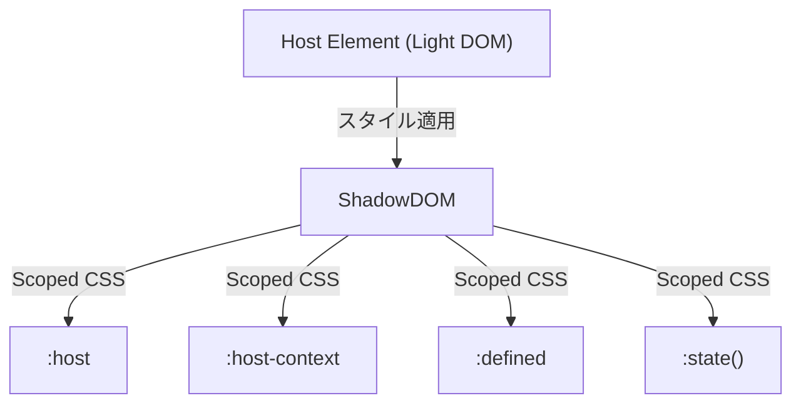

# 🔹 Host-based CSS
Shadow DOM のホスト要素にスタイルを適用するための擬似クラスです。

|疑似クラス|説明|用途|
|---|---|---|
|`:defined`|カスタム要素が定義されたかどうか|未定義要素のスタイル制御|
|`:host`|シャドウ DOM のホスト要素にスタイル適用|カスタム要素の見た目調整|
|`:host(selector)`|特定のホストにスタイル適用|クラスや属性でデザイン変更|
|`:host-context(selector)`|親要素に応じてスタイル適用|ダークモードやレスポンシブ対応|
|`:state()`|カスタム要素が`expose` した状態を CSS で適用する擬似クラス|カスタム要素の内部状態を CSS で直接判定|

## 🔹 :defined
カスタム要素が登録 (customElements.define()) されたときに適用される擬似クラス です。
カスタム要素が定義されたかどうかに基づいてスタイルを変更できます。
未定義のカスタム要素には適用されません。

```html
<custom-element></custom-element>
<custom-element-undefined></custom-element-undefined>
```

```css
custom-element:defined {
  color: green;
}
```

### 使用例
```html
<!DOCTYPE html>
<html lang="ja">
<head>
  <style>
    custom-button {
      color: gray; /* 未定義の場合のスタイル */
    }

    custom-button:defined {
      color: blue; /* 定義後のスタイル */
    }
  </style>
</head>
<body>
  <custom-button>ボタン</custom-button>

  <script>
    setTimeout(() => {
      class CustomButton extends HTMLElement {}
      customElements.define("custom-button", CustomButton);
    }, 2000);
  </script>
</body>
</html>
```

custom-button は最初 グレー で表示され、2秒後に定義されると青色に変化 する。

## 🔹 :host
Shadow DOM のホスト要素全体にスタイルを適用できます。

```html
<custom-element></custom-element>
```

```css
/* Shadow DOM 内部のスタイル */
:host {
  display: block;
  border: 1px solid #333;
}
```

### 使用例

```html
<!DOCTYPE html>
<html lang="ja">
<body>
  <custom-box>コンテンツ</custom-box>

  <script>
    class CustomBox extends HTMLElement {
      constructor() {
        super();
        const shadow = this.attachShadow({ mode: "open" });
        shadow.innerHTML = `
          <style>
            :host {
              display: block;
              border: 2px solid black;
              padding: 10px;
              background-color: lightgray;
            }
          </style>
          <slot></slot>
        `;
      }
    }
    customElements.define("custom-box", CustomBox);
  </script>
</body>
</html>
```

- :host を使うことで、カスタム要素 `<custom-box>` 自体に ボーダーや背景色を適用できる。
- 通常の div {} のようなスタイル指定とは異なり、ホスト要素専用のスタイルを定義可能。

## 🔹 :host(selector)
特定のクラスや属性に基づいてスタイリングを変更できます。

```html
<custom-element class="primary"></custom-element>
```

```css
:host(.primary) {
  background-color: #007bff;
  color: white;
}
```

### 使用例

```html
<!DOCTYPE html>
<html lang="ja">
<head>
  <style>
    custom-box.special {
      color: red;
    }
  </style>
</head>
<body>
  <custom-box class="special">特別なスタイル</custom-box>
  <custom-box>通常のスタイル</custom-box>

  <script>
    class CustomBox extends HTMLElement {
      constructor() {
        super();
        const shadow = this.attachShadow({ mode: "open" });
        shadow.innerHTML = `
          <style>
            :host(.special) {
              border: 3px solid red;
              background-color: pink;
            }
            :host {
              display: block;
              padding: 10px;
              border: 2px solid black;
            }
          </style>
          <slot></slot>
        `;
      }
    }
    customElements.define("custom-box", CustomBox);
  </script>
</body>
</html>
```

- クラス special を持つ `<custom-box>` にのみ、異なるスタイルを適用 する。
- 通常の custom-box とは異なり、特定のクラスを持つ場合だけ 赤いボーダーとピンク背景 になる。


## 🔹 :host-context(selector)
ホスト要素の親要素に応じてスタイルを適用できます。

```html
<div class="dark-mode">
  <custom-element></custom-element>
</div>
```

```css
:host-context(.dark-mode) {
  background-color: black;
  color: white;
}
```
### 使用例

```html
<!DOCTYPE html>
<html lang="ja">
<head>
  <style>
    .dark-mode custom-box {
      color: white;
    }
  </style>
</head>
<body class="dark-mode">
  <custom-box>ダークモードのコンテンツ</custom-box>

  <script>
    class CustomBox extends HTMLElement {
      constructor() {
        super();
        const shadow = this.attachShadow({ mode: "open" });
        shadow.innerHTML = `
          <style>
            :host {
              display: block;
              padding: 10px;
              border: 2px solid black;
              background-color: lightgray;
              color: black;
            }

            :host-context(.dark-mode) {
              background-color: black;
              color: white;
            }
          </style>
          <slot></slot>
        `;
      }
    }
    customElements.define("custom-box", CustomBox);
  </script>
</body>
</html>
```
- `<body class="dark-mode">` のとき、custom-box の背景が黒、テキストが白になる。
- 親要素のクラスに応じてスタイルを変えたい場合に便利（例: dark-mode、mobile-view など）。


## 🔹 :state()
カスタム要素が expose した状態を CSS で適用する擬似クラスです。
`expose` 属性で公開された状態に基づいてスタイルを変更できます。
カスタム要素の内部状態をスタイルで制御するための新しい仕様 で、現在 試験的（Experimental） な機能です。

これは カスタム要素の内部状態を CSS で直接判定できる というもので、従来の attributeChangedCallback や classList を使わずに、より直感的な状態管理が可能になります。


```html
<custom-element state="loading"></custom-element>
```

```css
:host(:state(loading)) {
  opacity: 0.5;
  pointer-events: none;
}
```


### 使用例

```html
<custom-toggle></custom-toggle>
<button onclick="toggleState()">トグル</button>

<script>
  class CustomToggle extends HTMLElement {
    static states = ["on", "off"];

    constructor() {
      super();
      this.attachShadow({ mode: "open" }).innerHTML = `
        <style>
          :host(:state(on)) {
            background: green;
            color: white;
          }
          :host(:state(off)) {
            background: gray;
            color: black;
          }
        </style>
        <span>トグルスイッチ</span>
      `;

      this.toggleState = this.toggleState.bind(this);
      this.state = "off";
    }

    toggleState() {
      this.state = this.state === "on" ? "off" : "on";
      this.requestStateUpdate();
    }
  }

  customElements.define("custom-toggle", CustomToggle);

  function toggleState() {
    document.querySelector("custom-toggle").toggleState();
  }
</script>
```

- :state(on) のときに緑色、:state(off) のときにグレーになる。
- JS から this.state = "on"; などで状態を変更し、CSS 側でその状態を認識できる。


## 🔹 Host-based CSS の伝搬図


Host-based CSS を活用することで、外部の環境や状態に応じた動的なスタイリングが可能になります。
