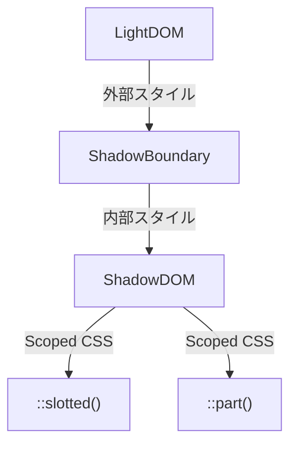

# Scoped CSS in Shadow DOM

Web Components の Scoped CSS は、外部のスタイルや JavaScript の影響を受けず、  
Shadow DOM 内部のスタイルを閉じ込めることができます。

Web Components の Scoped CSS では、以下の擬似クラスを使用して特定の要素にスタイルを付与できます。

## 🔹 擬似クラス一覧
|疑似クラス|説明|用途|
|---|---|---|
| `::slotted()`| `<slot>` に投影された要素のスタイリング| Shadow DOM 内の外部要素の装飾 |
| `::part()`| Shadow DOM 内部のパーツを外部からスタイル付与 | カスタム要素の一部をスタイリング |
| `::before`| 要素の前にコンテンツを挿入 | インジケータや装飾の追加 |
| `::after` | 要素の後にコンテンツを挿入 | インジケータや装飾の追加 |
| `::backdrop` | `<dialog>` 要素の背景にスタイルを適用| モーダル背景のデザイン変更|


## 🔹 ::slotted()
Shadow DOM の `<slot>` に投影された要素をスタイリングします。

```html
<!-- Web Component 内部 -->
<slot name="header"></slot>
```

```html
<!-- 親コンポーネント -->
<custom-element>
  <h2 slot="header">ヘッダーの内容</h2>
</custom-element>
```

```css
::slotted(h2) {
  color: blue;
  font-weight: bold;
}
```

この例では、`<slot>` に渡された `<h2>` 要素が青色かつ太字で表示されます。


## 🔹 ::part()
カスタム要素内の特定のパーツをスタイリングします。  
Shadow DOM 内部で `part` 属性を定義することで、外部のスタイルからアクセス可能です。

```html
<!-- Web Component 内部 -->
<button part="action-button">Click Me</button>
```

```css
custom-element::part(action-button) {
  background-color: red;
  color: white;
}
```


## 🔹 ::before, ::after
Shadow DOM 内部でも疑似要素を使ったスタイリングが可能です。

```html
<custom-element>
  <p>メインテキスト</p>
</custom-element>
```

```css
p::before {
  content: '▶ ';
  color: green;
}
```


## 🔹 ::backdrop
`<dialog>` 要素や `<details>` の背景にスタイルを適用する場合に使用します。

```html
<dialog open>
  <p>モーダルダイアログ</p>
</dialog>
```

```css
::backdrop {
  background-color: rgba(0, 0, 0, 0.5);
}
```


## 🔹 スタイルの伝搬フロー図



擬似クラスを活用することで、Shadow DOM 内のスタイリングを効果的にコントロールできるようになります。