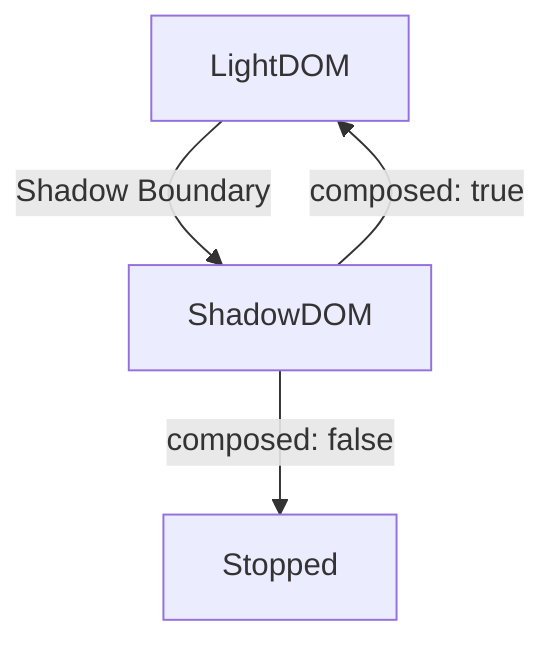
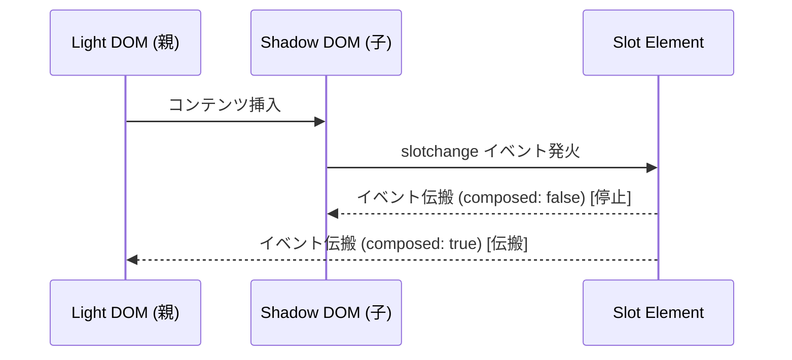

# Slots と Content の投影（Projection）

**Slot** は、Web Components の Shadow DOM 内に外部のコンテンツを注入するための特殊な要素です。  
主に再利用可能なコンポーネント設計を実現するために利用され、構造と内容を分離する役割を担います。

> [!IMPORTANT]
> Slot は Custom Element 内部の Shadow DOM においてのみ機能する仕様です。  
> つまり、Shadow DOM は Custom Elements なしでも使えますが、Slotは Custom Elements の内部に Shadow DOM を組み込んだ場合のみ動作します。
> |ケース|Shadow DOM|Slot 使用|
> |---|---|---|
> |Custom Element と一緒に使う|✅|✅|
> |普通の HTML 要素に使う|✅|❌|

## 🔹 Slot の主な特徴

- カスタム要素の内部（Shadow DOM）に外部からコンテンツを挿入できる
- スロットにはデフォルトのコンテンツを設定できる
- 複数のスロット（名前付きスロット）を定義できる
- CSS ::slotted() 疑似クラスを使ってスロットのスタイルを適用できる

## 🔹 基本的な使い方

Slot の最も基本的な使い方は、Shadow DOM 内部に外部の DOM 要素（Light DOM）を挿入することです。

```html
<custom-element>
  <p>この内容はスロットに挿入されます。</p>
</custom-element>
```

```typescript
class CustomElement extends HTMLElement {
  constructor() {
    super();
    const shadow = this.attachShadow({ mode: 'open' });
    shadow.innerHTML = `
      <style>
        div { padding: 10px; border: 1px solid #ccc; }
      </style>
      <div>
        <slot></slot>
      </div>
    `;
  }
}

customElements.define('custom-element', CustomElement);
```

この場合、`<slot></slot>` の部分に `<custom-element>` 内の `<p>` 要素が挿入されます。

## 🔹 名前付き Slot

複数の要素を整理するために、`name` 属性を使って名前付きのスロットを定義できます。  
これにより、特定の位置に指定されたコンテンツを挿入できます。

```html
<template id="named-template">
  <div class="card">
    <header>
      <slot name="header"></slot>
    </header>
    <section>
      <slot></slot> <!-- デフォルトスロット -->
    </section>
    <footer>
      <slot name="footer"></slot>
    </footer>
  </div>
</template>

<my-card>
  <h1 slot="header">ヘッダー部分</h1>
  <p>これはデフォルトのスロットです。</p>
  <p slot="footer">フッター部分</p>
</my-card>
```

```typescript
class MyCard extends HTMLElement {
  constructor() {
    super();
    const shadow = this.attachShadow({ mode: 'open' });
    
    // テンプレートの取得と複製
    const template = document.getElementById('named-template') as HTMLTemplateElement;
    shadow.appendChild(template.content.cloneNode(true));
  }
}

customElements.define('my-card', MyCard);
```

**実行結果**
```
<div class="card">
  <header>
    <h1>ヘッダー部分</h1>
  </header>
  <section>
    <p>これはデフォルトのスロットです。</p>
  </section>
  <footer>
    <p>フッター部分</p>
  </footer>
</div>
```

## 🔹 Fallback Content（デフォルトコンテンツ）

スロットが埋められなかった場合に、デフォルトの内容を表示することができます。
`<slot>` 内に要素を配置することでデフォルトコンテンツを設定できます。

```html
<template id="default-template">
  <div class="card">
    <slot>デフォルトのコンテンツです</slot>
  </div>
</template>

<my-card></my-card>
```

```typescript
class FallbackCard extends HTMLElement {
  constructor() {
    super();
    const shadow = this.attachShadow({ mode: 'open' });
    
    const template = document.getElementById('default-template') as HTMLTemplateElement;
    shadow.appendChild(template.content.cloneNode(true));
  }
}

customElements.define('my-card', FallbackCard);
```

**実行結果**
```
<div class="card">
  デフォルトのコンテンツです
</div>
```

## 🔹 Slot の変更検知（slotchange イベント）

`slotchange` イベントを使うことで、スロット内のコンテンツ変更を検知できます。

```typescript
class SlotChangeExample extends HTMLElement {
  constructor() {
    super();
    const shadow = this.attachShadow({ mode: 'open' });
    shadow.innerHTML = `
      <slot></slot>
    `;

    // スロットの変更を検知
    shadow.querySelector('slot')?.addEventListener('slotchange', () => {
      console.log('スロットの内容が変更されました');
      // スロットに割り当てられた要素を取得
      const assignedNodes = shadow.querySelector('slot')?.assignedNodes();
      console.log('割り当てられたノード:', assignedNodes);
    });
  }
}

customElements.define('slot-change-example', SlotChangeExample);
```

```html
<slot-change-example>
  <p>初期コンテンツ</p>
</slot-change-example>

<script>
  // 2秒後にスロットの内容を変更
  setTimeout(() => {
    const element = document.querySelector('slot-change-example');
    element.innerHTML = '<p>新しいコンテンツ</p>';
  }, 2000);
</script>
```

## 🔹 Shadow DOM 内部の Slot

Shadow DOM内部で `<slot>` は外部の Light DOM 要素と連動しています。これにより、外部から提供されたコンテンツを内部構造の適切な位置に配置できます。

```html
<custom-shadow>
  <p slot="content">ライトDOMの内容</p>
</custom-shadow>
```

```typescript
class CustomShadow extends HTMLElement {
  constructor() {
    super();
    const shadow = this.attachShadow({ mode: 'open' });
    shadow.innerHTML = `
      <div>
        Shadow DOM内部:
        <slot name="content"></slot>
      </div>
    `;
  }
}

customElements.define('custom-shadow', CustomShadow);
```

## 🔹 Slot の CSS スタイリング

Slot に挿入された要素のスタイルを制御するには、`::slotted()` 疑似クラスを使用します。

```typescript
class StyledSlot extends HTMLElement {
  constructor() {
    super();
    const shadow = this.attachShadow({ mode: 'open' });
    shadow.innerHTML = `
      <style>
        /* スロットに挿入された p 要素のスタイル */
        ::slotted(p) {
          color: blue;
          font-weight: bold;
        }
        /* スロットに挿入された span 要素のスタイル */
        ::slotted(span) {
          color: red;
          font-style: italic;
        }
      </style>
      <div>
        <slot></slot>
      </div>
    `;
  }
}

customElements.define('styled-slot', StyledSlot);
```

```html
<styled-slot>
  <p>これは青色で太字のテキストです</p>
  <span>これは赤色で斜体のテキストです</span>
  <div>これはスタイルが適用されていません</div>
</styled-slot>
```

## 🔹 イベント伝搬と Slot

Shadow DOM の境界を越えてイベントを伝搬させるには、`composed: true` オプションを指定する必要があります。
これにより、Shadow DOM 内部から外部へイベントを伝播させることができます。

```typescript
class EventSlot extends HTMLElement {
  constructor() {
    super();
    const shadow = this.attachShadow({ mode: 'open' });
    shadow.innerHTML = `
      <button id="innerButton">ボタンをクリック</button>
      <slot></slot>
    `;

    shadow.getElementById('innerButton')?.addEventListener('click', () => {
      // Shadow DOM の境界を越えて伝搬するイベント
      this.dispatchEvent(new CustomEvent('custom-click', { 
        detail: { message: 'ボタンがクリックされました' },
        bubbles: true,
        composed: true // Shadow DOM の境界を越えて伝搬
      }));
    });
  }
}

customElements.define('event-slot', EventSlot);
```

```html
<event-slot></event-slot>

<script>
  document.addEventListener('custom-click', (e) => {
    const customEvent = e as CustomEvent;
    console.log(customEvent.detail.message); // "ボタンがクリックされました"
  });
</script>
```

### イベント伝搬のフロー



#### 具体例

- `composed: false` の場合、イベントは Shadow DOM の境界で止まり、Light DOM 側には伝搬しません。

- `composed: true` の場合、イベントは Shadow DOM の境界を越えて Light DOM 側へ伝搬します。


## 🔹 動的な Slot の追加・削除と slotchange イベント

Slot に動的にコンテンツを追加・削除した場合の挙動例です。  
`slotchange` イベントが発火し、内容の変更を検知できます。

```typescript
class DynamicSlotExample extends HTMLElement {
  constructor() {
    super();
    const shadow = this.attachShadow({ mode: 'open' });

    shadow.innerHTML = `
      <style>
        ::slotted(div) {
          color: green;
          border: 1px solid #ccc;
          margin: 5px;
          padding: 5px;
        }
      </style>
      <slot></slot>
      <button id="add">Add Slot</button>
      <button id="remove">Remove Slot</button>
    `;

    const slot = shadow.querySelector('slot');
    const buttonAdd = shadow.getElementById('add');
    const buttonRemove = shadow.getElementById('remove');

    // slotchange イベントのリスナー登録
    slot?.addEventListener('slotchange', () => {
      console.log('slotchange イベントが発火しました');
      console.log('割り当てられたノード:', slot.assignedNodes());
    });

    buttonAdd?.addEventListener('click', () => {
      const div = document.createElement('div');
      div.textContent = '追加された Slot コンテンツ';
      div.setAttribute('slot', '');
      this.appendChild(div);
    });

    buttonRemove?.addEventListener('click', () => {
      const slotContent = this.querySelector('div');
      slotContent?.remove();
    });
  }
}

customElements.define('dynamic-slot-example', DynamicSlotExample);
```

### イベント伝搬のフロー

イベント伝搬の流れをより具体的に示したシーケンス図です。




## 🔹 ネストされた Slot のスタイリング

`::slotted()` 疑似クラスは直接の子要素のみを対象としますが、ネストされた要素に対してもスタイルを付与する例です。

```typescript
class NestedSlotExample extends HTMLElement {
  constructor() {
    super();
    const shadow = this.attachShadow({ mode: 'open' });

    shadow.innerHTML = `
      <style>
        ::slotted(div span) {
          color: blue;
          font-weight: bold;
        }
      </style>
      <slot></slot>
    `;
  }
}

customElements.define('nested-slot-example', NestedSlotExample);
```

**使用例**
```html
<nested-slot-example>
  <div>
    <span>これはネストされた Slot の内容です</span>
  </div>
</nested-slot-example>
```


## 🔹 Slot API の活用

Slot 要素にはいくつかの便利なAPIメソッドが用意されています。

### 📌 assignedNodes() と assignedElements()

Slot に割り当てられたノードや要素を取得するメソッドです。

```typescript
class SlotAPI extends HTMLElement {
  constructor() {
    super();
    const shadow = this.attachShadow({ mode: 'open' });
    shadow.innerHTML = `
      <slot></slot>
    `;

    const slot = shadow.querySelector('slot');
    
    // connectedCallback で割り当てられたノードを確認
    this.connectedCallback = () => {
      // 割り当てられたノードを取得
      const nodes = slot?.assignedNodes();
      console.log('割り当てられたノード:', nodes);
      
      // 割り当てられた要素のみを取得
      const elements = slot?.assignedElements();
      console.log('割り当てられた要素:', elements);
    };
  }
}

customElements.define('slot-api', SlotAPI);
```

```html
<slot-api>
  <!-- コメントもノードとして扱われる -->
  <p>段落要素</p>
  テキストノード
  <span>スパン要素</span>
</slot-api>
```

## 🔹 複数のスロットを持つ複雑なコンポーネント例

```typescript
class ComplexCard extends HTMLElement {
  constructor() {
    super();
    const shadow = this.attachShadow({ mode: 'open' });
    shadow.innerHTML = `
      <style>
        :host {
          display: block;
          border: 1px solid #ccc;
          border-radius: 8px;
          overflow: hidden;
        }
        .card-header {
          background-color: #f0f0f0;
          padding: 10px;
          border-bottom: 1px solid #ccc;
        }
        .card-body {
          padding: 15px;
        }
        .card-footer {
          background-color: #f0f0f0;
          padding: 10px;
          border-top: 1px solid #ccc;
        }
        ::slotted(h2) {
          margin: 0;
          color: #333;
        }
        ::slotted(p) {
          margin: 0;
        }
      </style>
      <div class="card">
        <div class="card-header">
          <slot name="header">デフォルトヘッダー</slot>
        </div>
        <div class="card-body">
          <slot>デフォルトコンテンツ</slot>
        </div>
        <div class="card-footer">
          <slot name="footer">デフォルトフッター</slot>
        </div>
      </div>
    `;
  }
}

customElements.define('complex-card', ComplexCard);
```

```html
<complex-card>
  <h2 slot="header">カードのタイトル</h2>
  <p>これはカードの本文です。デフォルトスロットに挿入されます。</p>
  <button slot="footer">詳細を見る</button>
</complex-card>
```

## 🔹 制約と注意点

- Slot 内の要素は Shadow DOM 内の CSS の影響を直接受けない（`::slotted()` が必要）
- Slot に JavaScript で直接値を入れることはできない（親要素を変更する必要がある）
- Slot の再配置はできない（動的に Slot を変更するには slot 属性を変更する必要がある）
- ネストされた Shadow DOM での Slot 使用には注意が必要

## 🔹 まとめ

- Slot を使うことで、外部から Shadow DOM 内部にコンテンツを挿入できる
- 名前付き Slot で複数の挿入ポイントを定義可能
- デフォルトコンテンツで空の状態も適切に表示できる
- `slotchange` イベントで動的な変更を検知できる
- `::slotted()` 疑似クラスでスタイリングが可能
- イベント伝搬には `composed: true` が必要
- Slot API で割り当てられた要素の操作が可能