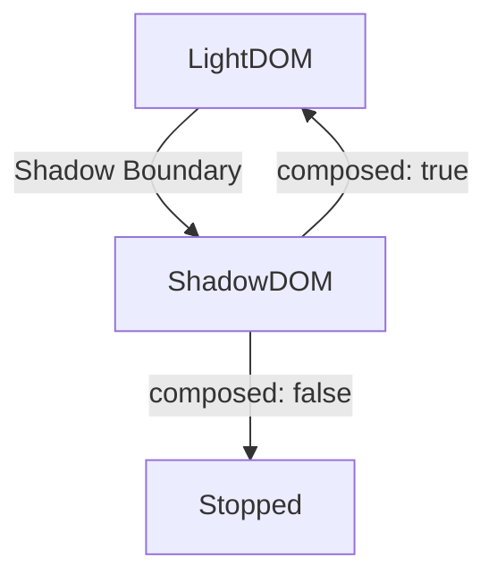

# Slots と content の 投影(Projection)

## Slotの基本

Slotは、Shadow DOM 内部に外部の DOM 要素（Light DOM）を挿入するための仕組みです。基本的な使い方として、以下のようなコードを考えてみましょう。

```html
<custom-element>
  <p>この内容はスロットに挿入されます。</p>
</custom-element>
```

```typescript
class CustomElement extends HTMLElement {
  constructor() {
    super();
    const shadow = this.attachShadow({ mode: 'open' });
    shadow.innerHTML = `
      <slot></slot>
    `;
  }
}

customElements.define('custom-element', CustomElement);
```

この場合、`<slot></slot>` の部分に `<custom-element>` 内の `<p>` 要素が挿入されます。


## 名前付きSlot

複数の要素を整理するために、名前付きのスロットを使用することができます。

```html
<custom-element>
  <span slot="header">ヘッダー部分</span>
  <p slot="content">コンテンツ部分</p>
</custom-element>
```

```typescript
class NamedSlots extends HTMLElement {
  constructor() {
    super();
    const shadow = this.attachShadow({ mode: 'open' });
    shadow.innerHTML = `
      <slot name="header"></slot>
      <slot name="content"></slot>
    `;
  }
}

customElements.define('named-slots', NamedSlots);
```


## Fallback Content

Slotが埋められなかった場合に、デフォルトの内容を表示することが可能です。

```html
<custom-element></custom-element>
```

```typescript
class FallbackSlot extends HTMLElement {
  constructor() {
    super();
    const shadow = this.attachShadow({ mode: 'open' });
    shadow.innerHTML = `
      <slot>デフォルトの内容です。</slot>
    `;
  }
}

customElements.define('fallback-slot', FallbackSlot);
```

この場合、外部からの要素が提供されない場合は `デフォルトの内容です。` が表示されます。


## 動的なSlot操作

JavaScriptを用いて動的にSlotの内容を変更することも可能です。

```typescript
const slot = document.querySelector('slot');

slot.addEventListener('slotchange', () => {
  console.log('Slot content changed!');
});

// 内容を動的に追加
const content = document.createElement('div');
content.textContent = '新しいコンテンツ';
document.querySelector('custom-element')?.appendChild(content);
```


## Shadow DOMとSlotの連携

Shadow DOM内部で `<slot>` は外部の Light DOM 要素と連動しています。例えば、次のような実装を考えてみます。

```html
<custom-shadow>
  <p slot="content">ライトDOMの内容</p>
</custom-shadow>
```

```typescript
class CustomShadow extends HTMLElement {
  constructor() {
    super();
    const shadow = this.attachShadow({ mode: 'open' });
    shadow.innerHTML = `
      <div>
        Shadow DOM内部
        <slot name="content"></slot>
      </div>
    `;
  }
}

customElements.define('custom-shadow', CustomShadow);
```

結果として、Shadow DOM内部にある `<slot name="content">` に、Light DOMの内容が映し出されます。


## イベント伝搬とSlot

Shadow DOMにおいて、イベントはデフォルトではバブリングしません。ただし、イベントのオプションで `composed: true` を指定することで、Shadow DOMを超えて伝搬させることができます。

```typescript
const button = document.querySelector('button');

button?.addEventListener('click', (e) => {
  console.log(e.composed); // true
});
```

### Mermaidによるフロー図




## slotchange イベントの監視

Slotの内容が変化した場合、`slotchange` イベントが発火します。

```typescript
const slot = document.querySelector('slot');

slot?.addEventListener('slotchange', () => {
  console.log('Slot content has been updated!');
});
```


## 実践例

### 複数Slotの切り替え

```html
<custom-multi-slot>
  <h1 slot="title">タイトル</h1>
  <p slot="description">説明文</p>
</custom-multi-slot>
```

```typescript
class MultiSlotElement extends HTMLElement {
  constructor() {
    super();
    const shadow = this.attachShadow({ mode: 'open' });
    shadow.innerHTML = `
      <slot name="title"></slot>
      <slot name="description"></slot>
    `;
  }
}

customElements.define('custom-multi-slot', MultiSlotElement);
```

各Slotが正しく切り替わり、表示されることを確認できます。
