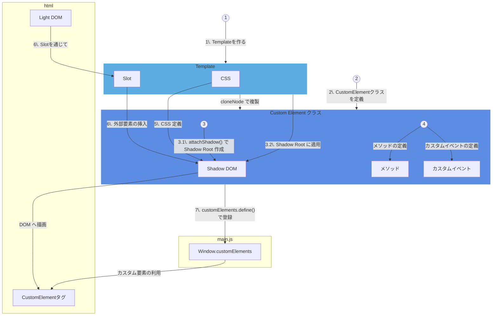

# Web Component の実装フロー
Web Component を実装する基本的な流れについて解説します。  
このセクションでは、以下の 7 つのステップに分けて学習します。

## 🔹 実装するの流れ

Web Componentを実装する基本的な流れは以下に挙げている通りです。

1. `<template>` 要素で、UIの部品を作る
2. `HTMLElement` を継承した CustomElementクラスを作る
3. CustomElementクラスに、Shadow Rootを定義し、これにtemplateをcloneNodeで append する
4. このCustom Elementにメソッドや、カスタムイベントを設定し、変化した場合のレンダリング方法を記述する
5. CSSもShadowRoot内に定義する。
6. `<slot>` など利用して、他の要素を入れ込むような仕組みも作る
7. window.customElements に、この作ったCustomElementクラスを`customElements.define()` で登録する。
8. 登録した、カスタム要素をHTMLにて利用する


## 🔹 1. Template 要素で UI を作成
まずは、`<template>` 要素を使って UI の構造を定義します。  
`<template>` 内の内容は初期状態では DOM に追加されず、`cloneNode` を使って複製することで利用します。

```html
<template id="my-template">
  <style>
    p {
      color: blue;
    }
  </style>
  <p>これはテンプレートです。</p>
</template>
```

## 🔹 2. HTMLElement を継承した Custom Element を作成
次に、`HTMLElement` を継承してカスタム要素のクラスを作成します。

```ts
class MyElement extends HTMLElement {
  constructor() {
    super();
  }
}
customElements.define('my-element', MyElement);
```

## 🔹 3. Shadow Root の作成と Template の適用
`attachShadow` メソッドを使って Shadow Root を定義し、  
`template` の内容を `cloneNode` で複製して追加します。

```ts
class MyElement extends HTMLElement {
  constructor() {
    super();
    const shadow = this.attachShadow({ mode: 'open' });

    // テンプレートを複製して追加
    const template = document.getElementById('my-template') as HTMLTemplateElement;
    shadow.appendChild(template.content.cloneNode(true));
  }
}
customElements.define('my-element', MyElement);
```

## 🔹 4. メソッドやカスタムイベントの定義
カスタム要素にメソッドを定義し、状態の更新やイベントの発火を行います。

```ts
class MyElement extends HTMLElement {
  setMessage(message: string) {
    const paragraph = this.shadowRoot?.querySelector('p');
    if (paragraph) {
      paragraph.textContent = message;
    }
  }
}
```

## 🔹 5. Shadow Root 内に CSS を定義
Shadow DOM 内部に CSS を定義することで、外部のスタイルから独立したデザインを持たせます。

```html
<template id="my-template">
  <style>
    p {
      font-size: 18px;
      color: darkgreen;
    }
  </style>
  <p>独立したスタイルの要素です。</p>
</template>
```

## 🔹 6. Slot を使って外部要素の投影
Slot を使うことで、外部から渡された要素を指定した位置に投影できます。

```html
<template id="my-template">
  <slot></slot>
</template>
```

```html
<my-element>
  <p>外部の内容がここに表示されます。</p>
</my-element>
```

## 🔹 7. Custom Elements の定義と登録
最後に、`customElements.define()` で Web Component として登録します。

```ts
customElements.define('my-element', MyElement);
```

```html
<my-element></my-element>
```

## 🔹 8. カスタム要素の HTML への利用
定義したカスタム要素は、通常の HTML 要素と同じように利用できます。  
`index.html` 内でタグを宣言するだけで、Web Component として認識されます。

```html
<!DOCTYPE html>
<html lang="ja">
  <head>
    <meta charset="UTF-8">
    <title>Web Component の利用例</title>
  </head>
  <body>
    <!-- カスタム要素の利用 -->
    <my-element></my-element>
  </body>
</html>
```

## 🔹 Web Component 実装図



## 🔹 まとめ
1. `<template>` 要素で基本構造を定義
2. `HTMLElement` を継承してクラスを作成
3. Shadow DOM と Template を結合
4. メソッドやカスタムイベントを追加
5. 内部に独立した CSS を定義
6. `<slot>` を活用して外部要素の投影
7. `customElements.define()` で登録
8. **HTML 内でタグとして利用**


Web Component の基本的な流れが一通り完結しました。  
次のセクションでは、この流れを実際のプロジェクトに適用していきます。
